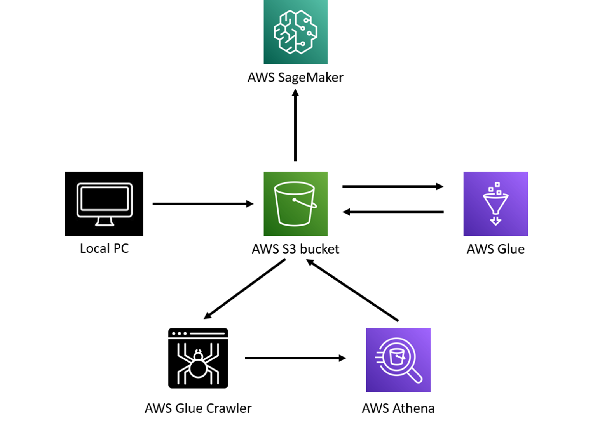

<h1 align="center">Welcome to Medical-X 👋</h1>

  
  

> Medical-X is an US insurance cost predicting linear regression model. Mainly built and used for learning about Machine Learning tools in Amazon Web Services (AWS).

## Contributors 

- C0918066 - [Rusiru Fernando](https://github.com/RuFerdZ)
- C0904675 - [Yolimar Rios](https://github.com/yolimar01)
- C0908671 - [Chris Mary Bulatao](https://github.com/ChrisMary-Bulatao)
- C0903980 - [Vihangi Kolamunna](https://github.com/vihangihk)
- C0906287 - [William Binitie](https://github.com/Jaimewill0511)

## Architecture

  

## ETL Pipeline

  

## Author

👤 **Rusiru Fernando**

* Website: https://rusiru.me
* Twitter: [@RuFerdz\_LK](https://twitter.com/RuFerdz\_LK)
* Github: [@RuFerdZ](https://github.com/RuFerdZ)
* LinkedIn: [@rusirufernando](https://linkedin.com/in/rusirufernando)

## Show your support

Give a ⭐️ if this project helped you!
